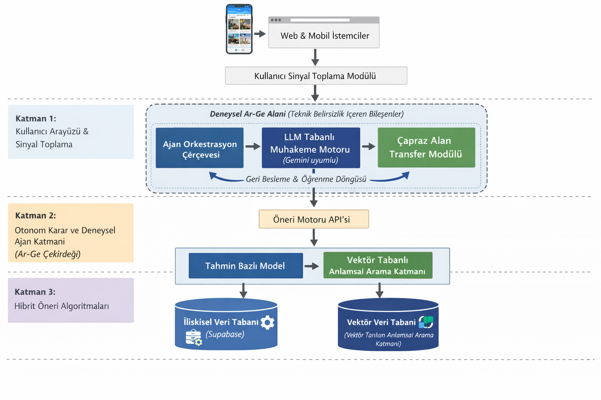

# 🌍 Tripzy - AI Powered Recommendation Engine

> **Project Status:** Active Development (TÜBİTAK 1507 R&D Candidate)
> **Live Demo:** [Click Here](https://tripzytravelanti.vercel.app)

## 🚀 Project Overview
Tripzy is a next-generation recommendation engine that solves the **"Cold Start"** problem in the travel industry using **Autonomous Agents**. Unlike traditional collaborative filtering, Tripzy uses a **Hybrid Vector Space** approach to provide zero-shot recommendations.

## 🏗️ System Architecture
The system is built on a 3-layer Agentic Workflow managed by **Google Antigravity**.

## 🛠️ Tech Stack
* **AI Core:** Google Gemini 3 & Antigravity IDE (Agent Orchestration)
* **Memory:** Pinecone Vector Database (Long-term semantic memory)
* **Backend:** Python FastAPI (Asynchronous Microservices)
* **Frontend:** HTML5 / React 19 (Context-Aware Interface)
* **Algorithm:** SVD++ & Cross-Domain Transfer Learning

## 📂 Repository Structure
* `/src`: Frontend source codes (React/Vite).
* `/api`: (Planned) Python backend agents and Gemini wrappers.
* `/docs`: Architecture diagrams and R&D documentation.

---
*© 2025 Tripzy DevOps Team - Confidential R&D Project*
