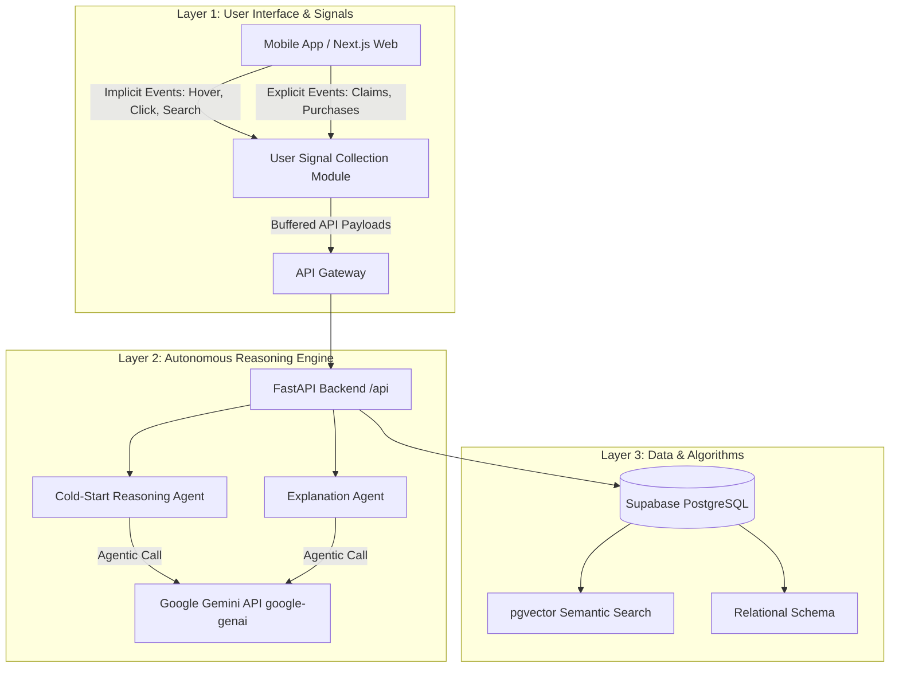
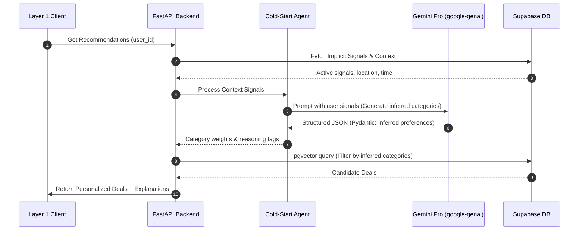

# R&D Technical Report: Autonomous Agentic Travel Recommendation Engine
**Project Name:** Tripzy.travel  
**Document Type:** Technical Design & R&D Grant Application (TÜBİTAK 1507 Reference Standard)  
**Security Class:** Confidential / Proprietary R&D  

---

## 1. Project Summary & Innovation Merit (Proje Özeti ve Yenilikçi Yönü)

In the tourism and travel commerce industry, personalization engines are heavily constrained by the **"Cold Start" problem**—the inability to provide relevant recommendations to new users who possess zero transaction or browsing history. Traditional recommendation systems rely on Collaborative Filtering (requiring historical interaction matrices) or content-based rules that default to generic, low-conversion "popular" items for new users.

**Tripzy.travel** resolves this industry-wide bottleneck by introducing an **Autonomous Agent-Based Recommendation Engine** designed specifically for cross-domain lifestyle projection and real-time semantic query processing. 

### Key Technical Innovations:
1. **Cross-Domain Lifestyle Projection:** Instead of waiting for travel bookings, the system monitors short-term, high-frequency, non-travel signals (local dining, cafe check-ins, active coupon claims, category browsing patterns, and geofence entries) and projects these behaviors into a latent multidimensional vector space to predict travel preferences.
2. **LLM-Based Autonomous Reasoning Agents:** Utilizing the Google Gemini (`google-genai`) SDK, the system employs autonomous agents that reason about a user's latent context, explain *why* a specific deal fits their current lifestyle, and determine the optimal moment to transition the user from generic fallback recommendations to specialized personalization.
3. **Structured Verification and R&D Validation:** A multi-layered validation suite combining Pytest (for API/Agent reliability) and Playwright (for E2E desktop/mobile responsiveness and live staging testing) guarantees algorithmic stability across local, preview, and production environments.

---

## 2. System Architecture & 3-Layer Design (Sistem Mimarisi)

The architecture is divided into three distinct layers to decouple signal ingestion, cognitive reasoning, and data persistence:



### Layer 1: User Interface & Signal Ingestion (Vite / React Native)
Collects implicit signals (session duration, card hovers, categories scrolled, search terms) and explicit signals (coupon claims, purchases). Rather than flood the network, the **User Signal Collection Module** buffers events client-side and transmits them in batches to reduce server load and latency.

### Layer 2: Autonomous Reasoning Engine (Python / FastAPI)
A high-performance Python microservice that acts as the coordinator ("the Brain"). When recommendations are requested, the engine coordinates:
* **The Cold-Start Agent:** Evaluates sparse user metadata, extracts lifestyle indicators, and infers high-probability travel category alignments.
* **The Explanation Agent:** Dynamically generates natural language reasoning explaining to the user why a specific deal is recommended, increasing transparency and click-through rates.

### Layer 3: Data & Algorithms (Supabase / pgvector)
Stores core application state, user activities, partner metrics, and high-dimensional vector embeddings. Relies on PostgreSQL's `pgvector` extension for semantic search and fast nearest-neighbor lookups.

---

## 3. Mathematical & Algorithmic Recommendation Models

To deliver recommendations across all stages of a user’s lifecycle, Tripzy implements a hybrid algorithm combining Latent Factor Matrix Factorization (for warm users) and Vector Space Cosine Similarity (for cold-start and context-aware matching).

### 3.1. Latent Factor Collaborative Filtering (Warm Users)
For users with established interaction histories, rating predictions $\hat{r}_{u,i}$ (expressing user $u$'s interest in deal $i$) are modeled using an SVD++ formulation, which incorporates both explicit ratings and implicit interaction histories:

$$\hat{r}_{u,i} = \mu + b_u + b_i + q_i^T \left( p_u + |I_u|^{-\frac{1}{2}} \sum_{j \in I_u} y_j \right)$$

Where:
* $\mu$ is the global average rating/engagement score.
* $b_u$ and $b_i$ are the user and item bias parameters.
* $p_u \in \mathbb{R}^k$ and $q_i \in \mathbb{R}^k$ are the latent factor representations of user $u$ and item $i$ in a $k$-dimensional space.
* $I_u$ is the set of items with which user $u$ has implicitly interacted.
* $y_j \in \mathbb{R}^k$ represents the implicit feedback contribution of item $j$ to the user's preference profile.

### 3.2. Vector Space Content Retrieval (Semantic Search)
To match semantic search queries and item descriptions, we calculate the Cosine Similarity between the query vector $A$ and the deal description vector $B$:

$$\text{Similarity}(A, B) = \cos(\theta) = \frac{A \cdot B}{\|A\| \|B\|} = \frac{\sum_{m=1}^{N} A_m B_m}{\sqrt{\sum_{m=1}^{N} A_m^2} \sqrt{\sum_{m=1}^{N} B_m^2}}$$

Vectors are generated using OpenAI or Gemini embedding models and indexed in Supabase using HNSW (Hierarchical Navigable Small World) distance metrics.

### 3.3. Cold-Start Cross-Domain Behavioral Transfer (Lifestyle Projection)
When a user has zero travel transactions ($I_u = \emptyset$), the system constructs a synthetic user context vector $C_u$ by projecting local lifestyle signals (e.g., dining preferences, shopping patterns) into the travel domain:

$$C_u = \sum_{s \in S_u} w_s \cdot \vec{E}(s)$$

Where:
* $S_u$ is the set of active lifestyle signals detected from the user's local actions.
* $w_s$ is a decay weight based on signal frequency and time-elapsed: $w_s = e^{-\lambda t}$.
* $\vec{E}(s)$ is the category embedding vector associated with signal $s$.

The final ranking score $S(u, i)$ for a deal $i$ is a weighted fusion:

$$S(u, i) = \alpha \cdot \hat{r}_{u,i} + (1 - \alpha) \cdot \cos\left(C_u, \vec{E}(i)\right)$$

For absolute cold-start users, $\alpha$ is dynamically set to $0$, relying entirely on the lifestyle projection $\cos\left(C_u, \vec{E}(i)\right)$ before gradually increasing as transaction history is accumulated.

---

## 4. Autonomous Agentic Reasoning & Explainability

The reasoning layer is built on the Google Gemini API using the modern `google-genai` SDK. Pydantic is strictly enforced on all LLM interfaces to guarantee structured outputs and prevent API schema deviations.



### Prompt Engineering & Structured Outputs
The backend implements rigid schema validation:
```python
from pydantic import BaseModel, Field
from typing import List

class InferredPreference(BaseModel):
    category: str = Field(description="The target travel/lifestyle category")
    confidence: float = Field(description="Confidence score between 0.0 and 1.0")
    reasoning: str = Field(description="Internal logic for making this inference")

class ColdStartAnalysisResponse(BaseModel):
    primary_category: str
    secondary_categories: List[InferredPreference]
    explanation_template: str = Field(description="User-facing explanation hook")
```
This structured format ensures the AI output directly feeds into the SQL query parameters without regex parsing or processing errors.

---

## 5. Database Schema & Vector Indexes (Layer 3)

The PostgreSQL schema is optimized for hybrid operations:

| Table Name | Description | Key Columns / Indexes |
| :--- | :--- | :--- |
| `profiles` | User core profiles, roles, and subscription tiers. | `id` (UUID), `role` (user/partner/admin), `tier` (NONE, FREE, BASIC, PREMIUM, VIP) |
| `deals` | Available discounts, campaigns, and vendor details. | `id` (UUID), `status` (pending/approved), `required_tier` |
| `deal_embeddings` | Latent vector representation of deal content. | `deal_id` (FK), `embedding` (vector(1536)), `HNSW Index` |
| `user_activities` | Ingested user action logs (clicks, hovers, claims). | `id` (UUID), `user_id` (FK), `activity_type`, `payload` (JSONB) |
| `geofence_zones` | Geofence coordinates for local merchant push notifications.| `id` (UUID), `lat_long` (geography), `radius_meters` |

### Query Example: Embedding Similarity Search with RLS
```sql
CREATE OR REPLACE FUNCTION match_deals (
  query_embedding vector(1536),
  match_threshold float,
  match_count int
)
RETURNS TABLE (
  id uuid,
  title text,
  similarity float
)
LANGUAGE plpgsql STABLE
AS $$
BEGIN
  RETURN QUERY
  SELECT
    deals.id,
    deals.title,
    1 - (deal_embeddings.embedding <=> query_embedding) AS similarity
  FROM deals
  JOIN deal_embeddings ON deals.id = deal_embeddings.deal_id
  WHERE 1 - (deal_embeddings.embedding <=> query_embedding) > match_threshold
    AND deals.status = 'approved'
  ORDER BY deal_embeddings.embedding <=> query_embedding
  LIMIT match_count;
END;
$$;
```

---

## 6. Verification, Validation & Automated Test Harness

A highly robust, dual-mode test suite ensures the recommendation algorithms, database migrations, and frontend interactions function seamlessly.

### 6.1. Unit and Integration Testing (Pytest)
Located in `api/tests/`, the backend test suite uses `pytest` and mock Supabase/Gemini client fixtures to run hermetic, rapid tests of:
* Signal processing functions.
* Pydantic input/output validation.
* Recommendation endpoint response formats.

### 6.2. End-to-End Testing (Playwright)
Located in `e2e/`, the Playwright suite runs across two viewports (Mobile Chrome / Pixel 5 and Desktop Chrome) simulating complete user journeys:
1. **`auth.spec.ts`**: Role-based access control (RBAC) and redirect flows.
2. **`deals.spec.ts`**: Browsing deals, detail view inspection, and discount codes.
3. **`partner.spec.ts`**: Partner dashboard metrics rendering and geofence zone CRUD operations.

### 6.3. The Dual-Testing Mode (Mock vs. Live API)
To support development agility as well as cloud deployment validation, the Playwright tests support a conditional toggle:

#### Mode A: Mock Mode (Local & CI)
* **Default behavior:** `USE_LIVE_API=false`.
* **Mechanism:** Playwright intercepts all outgoing network requests matching Supabase endpoints (`**/auth/v1/*`, `**/rest/v1/*`) and fulfills them with deterministic JSON payloads.
* **Benefits:** Zero database side effects, zero API costs, execution finishes in under 15 seconds.

#### Mode B: Live Mode (Staging & Vercel Preview)
* **Trigger:** Set env variables: `USE_LIVE_API=true` and `BASE_URL=https://your-preview-url.vercel.app`.
* **Mechanism:** Playwright bypasses request interceptions, allowing the browser to interact with the real database and backend deployed in the cloud.
* **Overridable Credentials:**
  ```bash
  cross-env BASE_URL=https://tripzy-staging.vercel.app \
            USE_LIVE_API=true \
            TEST_USER_EMAIL=staging-user@tripzy.travel \
            TEST_USER_PASSWORD=StagingPassword123 \
            npx playwright test
  ```
* **Benefits:** Validates CORS rules, environment variable persistence, real Supabase RLS policies, and end-to-end database connectivity directly on Vercel preview environments before production merge.
