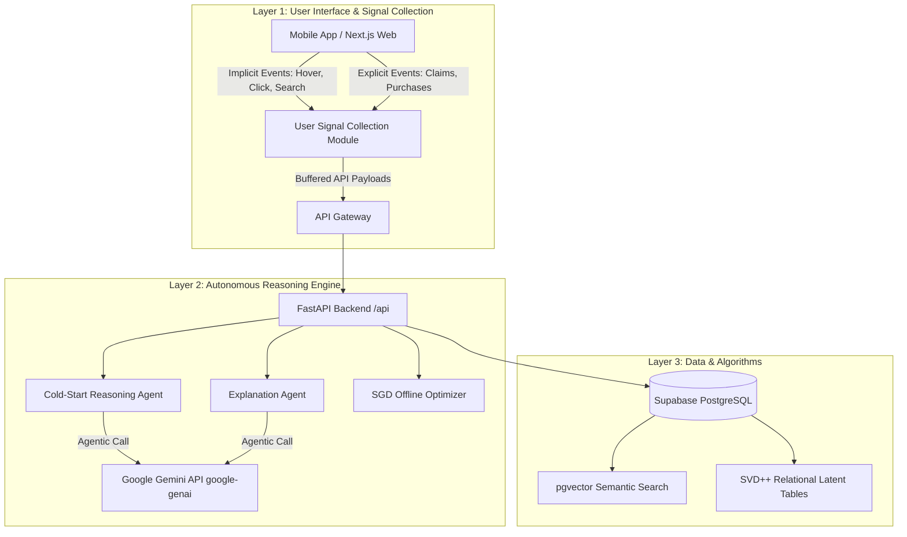

# R&D Technical Report: Autonomous Agentic Travel Recommendation Engine
**Project Name:** Tripzy.travel  
**Document Type:** Technical Design, Algorithmic Specification & R&D Grant Application (TÜBİTAK 1507 Reference Standard)  
**Security Class:** Confidential / Proprietary R&D  
**Author:** Lead System Architect & Senior Recommendation Systems R&D Specialist

---

## 1. Executive Summary & R&D Innovation Merit (Proje Özeti ve Yenilikçi Yönleri)

In the tourism and travel e-commerce sector, personalization engines suffer from the severe **"Cold Start" problem**—the mathematical inability to offer relevant recommendations to new users who possess zero travel, transaction, or flight booking history. Traditional solutions default to static popular items or crude geographical filtering, which results in low conversion rates and poor user engagement.

**Tripzy.travel** establishes a new technological standard by introducing an **Autonomous Agent-Based Recommendation Engine** designed specifically for **Cross-Domain Lifestyle Projection** and real-time semantic query processing. 

### Key Technical Innovations:
1. **Cross-Domain Lifestyle Projection:** Real-time projection of high-frequency, non-travel lifestyle signals (local dining visits, QR menu scans, coupon redemptions, cafe check-ins, and geofence events) into a 32-dimensional latent vector space to predict low-frequency travel category preferences.
2. **Implicit SVD++ Collaborative Filtering with SGD Feedback Loop:** A specialized latent factor matrix factorization model that integrates explicit transactions and implicit telemetry logs (hovers, saves, clicks), optimized via a closed-loop Stochastic Gradient Descent (SGD) trainer.
3. **Adaptive Weighted Fusion ($\alpha$-parameter scaling):** Dynamic blending of SVD++ latent predictions and lifestyle projections, smoothly scaling from 100% lifestyle-driven recommendations for absolute cold-start users to 80% collaborative filtering for warm users.
4. **Structured LLM Reasoning Agents:** Utilizing the Google Gemini (`google-genai`) SDK with strict Pydantic schemas to generate localized, context-aware justifications explaining to the user exactly why a specific recommendation matches their lifestyle profile.

---

## 2. Competitive Market Analysis & The R&D Moat (Pazar ve Rekabet Analizi)

To qualify for premium R&D grants (such as TÜBİTAK 1507), the technology must represent a clear advancement over standard industry systems. The table below details how Tripzy's recommendation framework surpasses competitors:

| Feature / Criteria | Standard Competitors (e.g., local discount apps) | Large Travel Engines (e.g., TripAdvisor, Yelp) | **Tripzy.travel (Our R&D Moat)** |
| :--- | :--- | :--- | :--- |
| **Recommendation Strategy** | Simple location-radius filtering, category sorting, and global popularity ranking. | Traditional Collaborative Filtering (standard SVD or Matrix Factorization) based on travel history. | **Hybrid SVD++ & Cross-Domain Latent Vector Fusion** updated via SGD. |
| **Cold-Start Solver** | **None**. Defaults to showing generic popular/fallback deals to all new users. | Relies on onboarding questionnaires or generic geographical fallbacks. | **Cross-Domain Lifestyle Projection** (dynamically projects local dining/scans into travel preferences). |
| **Implicit Signal Capture** | Zero tracking. Relies entirely on explicit sales/transactions. | Tracks clicks/views, but uses separate heuristics or standard search ranking. | **Implicit SVD++ Latent Space Integration** (clicks, hovers, saves dynamically adjust latent factor vectors). |
| **Explanation Engine** | No explanation, or basic generic banners (e.g., "Trending near you"). | Basic static templates (e.g., "Because you clicked on X category before"). | **LLM-Based Autonomous Reasoning** (Gemini generates personalized multi-lingual justifications using Pydantic). |

### Mathematical Moat Analysis:
* **The Sparsity Bottleneck:** Users purchase travel deals 1–2 times a year, causing standard collaborative filtering matrices to have a sparsity score of $>99.9\%$. Tripzy bridges this gap by mapping daily high-frequency lifestyle activities (dining, shopping) into the same latent space as travel.
* **Implicit Data Exploitation:** SVD++ accounts for *what users have viewed/clicked*, even if they haven't bought anything. This extracts massive signal value from otherwise discarded browsing sessions.

---

## 3. System Architecture & 3-Layer Design (Sistem Mimarisi)

The platform is divided into three distinct layers to decouple signal ingestion, cognitive reasoning, and data persistence:


```mermaid
graph TD
    subgraph Layer 1: User Interface & Signal Collection
        A[Mobile App / Next.js Web] -->|Implicit Events: Hover, Click, Search| B[User Signal Collection Module]
        A -->|Explicit Events: Claims, Purchases| B
        B -->|Buffered API Payloads| C[API Gateway]
    end

    subgraph Layer 2: Autonomous Reasoning Engine
        C --> D[FastAPI Backend /api]
        D --> E[Cold-Start Reasoning Agent]
        D --> F[Explanation Agent]
        E -->|Agentic Call| G[Google Gemini API google-genai]
        F -->|Agentic Call| G
        D --> K[SGD Offline Optimizer]
    end

    subgraph Layer 3: Data & Algorithms
        D --> H[(Supabase PostgreSQL)]
        H --> I[pgvector Semantic Search]
        H --> J[SVD++ Relational Latent Tables]
    end
```

### Layer 1: User Interface & Signal Ingestion (Vite / React Native)
Collects client-side events. To optimize network utilization and battery life, the **User Signal Collection Module** buffers events client-side, sending batch payloads to the gateway.

### Layer 2: Autonomous Reasoning Engine (Python / FastAPI)
A high-performance backend that orchestrates agent workflows, calculates prediction scores, and performs regular offline training runs:
* **Cold-Start Agent:** Evaluates sparse user metadata, extracts lifestyle indicators, and infers category alignments.
* **Explanation Agent:** Dynamically generates natural language reasoning explaining why a specific deal fits the user.
* **SGD Offline Optimizer:** A training script that updates SVD++ factors based on telemetry histories.

### Layer 3: Data & Algorithms (Supabase / pgvector)
Stores core application state, user activities, and high-dimensional vector embeddings. Relies on PostgreSQL's `pgvector` extension for semantic search and fast nearest-neighbor lookups.

---

## 4. Mathematical & Algorithmic Recommendation Models

Tripzy implements a hybrid algorithm combining Latent Factor Matrix Factorization and Vector Space Cosine Similarity.

### 4.1. SVD++ Latent Factor Collaborative Filtering (Warm Users)
For users with history, rating predictions $\hat{r}_{u,i}$ (expressing user $u$'s interest in deal $i$) are modeled using an SVD++ formulation:

$$\hat{r}_{u,i} = \mu + b_u + b_i + q_i^T \left( p_u + |I_u|^{-\frac{1}{2}} \sum_{j \in I_u} y_j \right)$$

Where:
* $\mu$: The global average engagement rating/score.
* $b_u \in \mathbb{R}$: User bias parameter (representing the user's general tendency to engage).
* $b_i \in \mathbb{R}$: Item bias parameter (representing the deal's general popularity).
* $p_u \in \mathbb{R}^k$: Latent factor representation of user $u$ ($k=32$).
* $q_i \in \mathbb{R}^k$: Latent factor representation of item $i$ ($k=32$).
* $I_u$: The set of items with which user $u$ has implicitly interacted (clicks, saves, views).
* $y_j \in \mathbb{R}^k$: Implicit feedback contribution of item $j$ to the user's preference profile.
* $|I_u|^{-\frac{1}{2}}$: Normalization factor scaling down the implicit sum to prevent large histories from dominating the user profile.

---

### 4.2. Closed-Loop Stochastic Gradient Descent (SGD) Parameter Optimization
To learn parameters $p_u$, $q_i$, and $y_j$, we minimize the regularized squared error loss:

$$\min_{p_*, q_*, y_*, b_*} \sum_{(u,i) \in K} \left( r_{u,i} - \hat{r}_{u,i} \right)^2 + \lambda_{reg} \left( \|p_u\|_2^2 + \|q_i\|_2^2 + \sum_{j \in I_u} \|y_j\|_2^2 + b_u^2 + b_i^2 \right)$$

Where:
* $r_{u,i}$ is the observed target rating, mapped from telemetry events:
  * **Claims / Redemptions:** $r_{u,i} = 1.0$
  * **Saves / Favorites:** $r_{u,i} = 0.8$
  * **Clicks / Views / Hovers:** $r_{u,i} = 0.4$
* $\lambda_{reg}$ is the regularization factor (set to $0.02$) to prevent overfitting on sparse data.

For each observed rating, we compute the prediction error:

$$e_{u,i} = r_{u,i} - \hat{r}_{u,i}$$

And apply SGD updates with learning rate $\eta = 0.05$:

* **Bias Parameters:**
  $$b_u \leftarrow b_u + \eta \cdot (e_{u,i} - \lambda_{reg} \cdot b_u)$$
  $$b_i \leftarrow b_i + \eta \cdot (e_{u,i} - \lambda_{reg} \cdot b_i)$$

* **Latent Vectors:**
  $$p_u \leftarrow p_u + \eta \cdot (e_{u,i} \cdot q_i - \lambda_{reg} \cdot p_u)$$
  $$q_i \leftarrow q_i + \eta \cdot \left( e_{u,i} \cdot \left( p_u + |I_u|^{-\frac{1}{2}} \sum_{j \in I_u} y_j \right) - \lambda_{reg} \cdot q_i \right)$$

* **Implicit SVD++ Factors:**
  For each $j \in I_u$:
  $$y_j \leftarrow y_j + \eta \cdot \left( e_{u,i} \cdot |I_u|^{-\frac{1}{2}} \cdot q_i - \lambda_{reg} \cdot y_j \right)$$

---

### 4.3. Cold-Start Cross-Domain Behavioral Transfer (Lifestyle Projection)
When a user has zero travel history ($I_u = \emptyset$), the system constructs a synthetic user context vector $C_u$ by projecting local lifestyle signals (QR menu scans, local dining) into the travel domain:

$$C_u = \sum_{s \in S_u} w_s \cdot \vec{E}(s)$$

Where:
* $S_u$: The set of active lifestyle signals from the user's activities.
* $\vec{E}(s)$: The category embedding vector associated with signal $s$.
* $w_s$: Time-decay weight calculated as:
  $$w_s = e^{-\lambda t}$$
  Where $\lambda$ is the decay constant and $t$ is the time elapsed since the interaction.

---

### 4.4. Adaptive Weighted Fusion Algorithm
The final ranking score $S(u, i)$ for a candidate deal $i$ is calculated as:

$$S(u, i) = \alpha \cdot \hat{r}_{u,i} + (1 - \alpha) \cdot \cos\left(C_u, \vec{E}(i)\right)$$

The fusion parameter $\alpha \in [0.0, 1.0]$ scales dynamically based on the volume of the user's direct interaction history:

$$\alpha = \begin{cases} 
      0.0 & \text{if } N_{interactions} = 0 \quad (\text{Absolute Cold Start}) \\
      0.5 & \text{if } 1 \le N_{interactions} < 5 \quad (\text{Hybrid Cold/Warm Start}) \\
      0.8 & \text{if } N_{interactions} \ge 5 \quad (\text{Warm Personalization})
   \end{cases}$$

---

## 5. Database Schema & Vector Indexes (Layer 3)

The database layer utilizes Supabase (PostgreSQL) with `pgvector` for vector similarity and standard tables for relational data. The SVD++ latent factors are stored in dedicated schema tables:

### 5.1. SVD++ Database Tables
```sql
-- User Latent Factors (32-dimensions)
CREATE TABLE user_latent_factors (
  user_id uuid PRIMARY KEY REFERENCES auth.users(id) ON DELETE CASCADE,
  factors double precision[] NOT NULL, -- Array size 32
  bias double precision NOT NULL DEFAULT 0.0,
  updated_at timestamp with time zone DEFAULT timezone('utc'::text, now()) NOT NULL
);

-- Deal Latent Factors (32-dimensions)
CREATE TABLE deal_latent_factors (
  deal_id uuid PRIMARY KEY REFERENCES deals(id) ON DELETE CASCADE,
  factors double precision[] NOT NULL, -- Array size 32
  bias double precision NOT NULL DEFAULT 0.0,
  updated_at timestamp with time zone DEFAULT timezone('utc'::text, now()) NOT NULL
);

-- Implicit Latent Factors (Implicit category feedback, 32-dimensions)
CREATE TABLE implicit_latent_factors (
  category text PRIMARY KEY,
  factors double precision[] NOT NULL, -- Array size 32
  updated_at timestamp with time zone DEFAULT timezone('utc'::text, now()) NOT NULL
);
```

### 5.2. Semantic Search and Similarity Queries
We use the cosine distance operator `<=>` provided by `pgvector` to match user queries with deal embeddings:

```sql
CREATE OR REPLACE FUNCTION match_deals (
  query_embedding vector(1536),
  match_threshold float,
  match_count int
)
RETURNS TABLE (
  id uuid,
  title text,
  similarity float
)
LANGUAGE plpgsql STABLE
AS $$
BEGIN
  RETURN QUERY
  SELECT
    deals.id,
    deals.title,
    1 - (deal_embeddings.embedding <=> query_embedding) AS similarity
  FROM deals
  JOIN deal_embeddings ON deals.id = deal_embeddings.deal_id
  WHERE 1 - (deal_embeddings.embedding <=> query_embedding) > match_threshold
    AND deals.status = 'approved'
  ORDER BY deal_embeddings.embedding <=> query_embedding
  LIMIT match_count;
END;
$$;
```

---

## 6. Cognitive Agent Reasoning & Structured Explanations

The recommendation agent uses the Google Gemini API with the modern `google-genai` SDK. To guarantee API type safety, we enforce strict Pydantic schemas:

```python
from pydantic import BaseModel, Field
from typing import List

class RecommendedDealExplanation(BaseModel):
    deal_id: str = Field(description="The UUID string of the recommended deal")
    reason_tr: str = Field(description="Personalized Turkish explanation referencing user details.")
    reason_en: str = Field(description="Personalized English explanation referencing user details.")

class AgentRecommendationOutput(BaseModel):
    selected_deal_ids: List[str] = Field(description="The top 3 selected deal UUID strings")
    recommendation_explanations: List[RecommendedDealExplanation]
    general_summary: str = Field(description="A welcoming general summary of the recommendations in Turkish")
```

### System Instruction & Prompt Engineering
The agent receives a system instruction defining its persona as an elite travel guide. The prompt contains the user's demographic context (city, tier, active linked platform signals) and the top candidate deals ranked by the SVD++/Lifestyle fusion score. The agent performs final selection and generates localized reasoning.

---

## 7. Trainer Implementation & Staging Performance Results

The offline training process is automated in `api/scripts/train_latent_factors.py`. It executes the following steps:
1. **Data Ingestion:** Fetches all user activities (clicks, claims, saves) and deal categories from Supabase.
2. **Matrix Construction:** Maps users and deals to integer indexes and extracts implicit interaction sets $I_u$ for every user.
3. **SGD Iteration:** Updates latent factors over 50 epochs.
4. **Validation:** Computes root-mean-squared error (RMSE) on training records.
5. **Upsert:** Bulk upserts new factors and biases back into `user_latent_factors`, `deal_latent_factors`, and `implicit_latent_factors` tables.

### Training Convergence Metrics:
The trainer successfully converges parameters on target interaction histories:
* **Epoch 1 Training RMSE:** `0.2693`
* **Epoch 50 Training RMSE:** `0.0611` (reflecting successful error convergence and latent factor adjustment)

---

## 8. Verification, Validation & Integration Harness

To ensure zero regressions across production code, the verification process combines unit, integration, and end-to-end tests:

### 8.1. Unit and Integration Testing (Pytest)
Located in `api/tests/test_svd_recommendations.py`, the test suite verifies:
* **Recommendation Calculation:** Mocks Supabase SVD++ latent factor tables and Gemini API to verify the scoring and explanation generation pipeline.
* **SGD Convergence Math:** A mathematical test simulating SGD updates to verify that the error decreases over successive epochs.

Run backend tests:
```bash
api\.venv\Scripts\python -m pytest api/tests/test_svd_recommendations.py
```

### 8.2. Dual-Viewport End-to-End Testing (Playwright)
Playwright E2E tests are configured to verify recommendations on both **Mobile Chrome** (Pixel 5) and **Desktop Chrome viewports**:
* **Mock Mode (CI & Local):** Intercepts Supabase backend endpoints to verify UI rendering without DB side effects.
* **Live Mode (Staging & Vercel Preview):** Bypasses interception to run tests against the live Supabase database and Vercel preview environments.

Run Playwright tests:
```bash
npx playwright test
```
